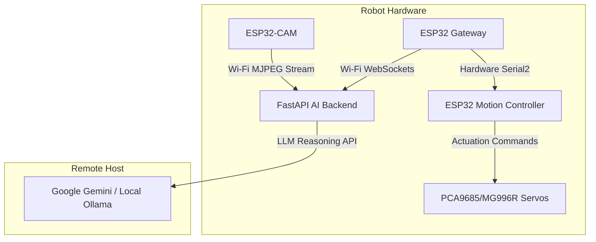
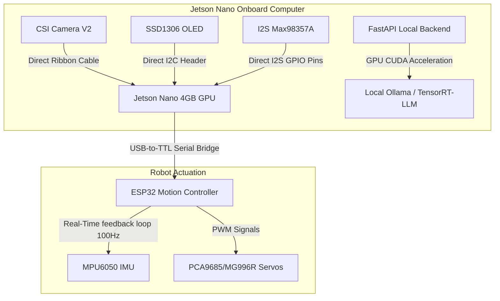

# 🧠 Omni-Morph Robot: Nvidia Jetson Nano Upgrade Blueprint
> **Version 1.0 (Edge Autonomy Architecture)**  
> This blueprint outlines the complete system migration path to transition the Omni-Morph Robot from a tethered distributed network architecture to an untethered, onboard GPU-accelerated edge platform using an **Nvidia Jetson Nano**.

---

## 📐 System Architecture Comparison

### Before (Tethered WebSockets Architecture)


### After (Untethered Jetson Nano Edge Architecture)


---

## 📋 Bill of Materials (BOM) Additions

To perform this upgrade, acquire the following hardware components:

| Component | Specification | Quantity | Purpose |
| :--- | :--- | :--- | :--- |
| **Nvidia Jetson Nano** | Developer Kit (4GB RAM version recommended) | 1 | Onboard Edge Cognitive Layer |
| **CSI Camera V2** | Sony IMX219 sensor (160° Wide-Angle) | 1 | Low-latency visual feed |
| **QS-1212CCBA-80W** | High-Current DC-DC Buck Converter (Input: 7-40V, Output: 5V @ 4-6A) | 1 | Stable power delivery to Jetson Nano |
| **CP2102 Adapter** | USB-to-TTL UART Serial Bridge | 1 | Direct physical connection to Motion ESP32 |
| **Wi-Fi Card (M.2)** | Intel Dual Band Wireless-AC 8265 | 1 | Local wireless debugging & swarm links |

---

## ⚡ Power Supply Routing Configuration

The Jetson Nano Developer Kit requires **5V @ 4A (20W)** peak power when utilizing the GPU. Standard micro-USB supplies are insufficient.

```
       [ 2S LiPo Battery: 7.4V - 8.4V ]
                      │
           ┌──────────┴──────────┐
           ▼                     ▼
     [ 5V 6A Buck ]        [ 5V 3A Buck ]
           │                     │
      (J48 Jumper)         (Micro-USB/Vin)
           │                     │
           ▼                     ▼
    [ Jetson Nano ]       [ ESP32 Motion ]
     (Barrel Jack)
```

1. **J48 Jumper Integration**: Install a jumper pin on the **J48 header** (next to the barrel jack) on the Jetson Nano Dev Kit to disable Micro-USB power and enable high-current Barrel Jack power.
2. **Regulation Setup**: Tune the high-current DC-DC Buck converter output to precisely **5.1V** (to prevent voltage drops under CPU/GPU spikes) before connecting to the Jetson Nano barrel connector.

---

## 🔌 Wiring & Pinout Modifications

### 1. Jetson Nano to ESP32 Motion Controller
Instead of wireless WebSockets, communication is bridged over direct hardware UART using a USB-to-TTL converter:

```
[ Jetson Nano USB Port ] <─── USB Cable ───> [ CP2102 Converter ]
                                                  │
                                                  ├─► RXD  ───► ESP32 GPIO 17 (TXD2)
                                                  ├─► TXD  ───► ESP32 GPIO 16 (RXD2)
                                                  └─► GND  ───► ESP32 GND
```

### 2. Audio & Display Pinouts
The SSD1306 OLED display and Max98357A I2S Audio Amp connect directly to the Jetson Nano GPIO Header:

* **I2C SSD1306 OLED Connection**:
  * OLED `VCC` ──► Jetson Pin 2 (5V) or Pin 1 (3.3V)
  * OLED `GND` ──► Jetson Pin 9 (GND)
  * OLED `SDA` ──► Jetson Pin 3 (I2C1_SDA / GPIO 12)
  * OLED `SCL` ──► Jetson Pin 5 (I2C1_SCL / GPIO 13)

* **I2S Max98357A Amplifer Connection**:
  * Amp `LRC` (Left-Right Clock) ──► Jetson Pin 35 (I2S_LRCK)
  * Amp `BCLK` (Bit Clock) ──► Jetson Pin 12 (I2S_SCLK)
  * Amp `DIN` (Data In) ──► Jetson Pin 40 (I2S_SDOUT)
  * Amp `GND` ──► Jetson Pin 34 (GND)
  * Amp `VIN` ──► Jetson Pin 4 (5V)

---

## 🖥️ Software Stack Migration Guide

### 1. Local Vision Layer Integration
Modify `ai_backend/app/tools/vision.py` to capture directly from the local CSI pipeline using a GStreamer pipeline instead of network streams:

```python
import cv2

def get_csi_camera_pipeline(width=640, height=480, framerate=30, flip_method=0):
    return (
        "nvarguscamerasrc ! "
        "video/x-raw(memory:NVMM), "
        f"width=(int){width}, height=(int){height}, "
        f"format=(string)NV12, framerate=(fraction){framerate}/1 ! "
        f"nvvidconv flip-method={flip_method} ! "
        "video/x-raw, format=(string)BGRx ! "
        "videoconvert ! "
        "video/x-raw, format=(string)BGR ! appsink"
    )

# To capture frame in local mode:
cap = cv2.VideoCapture(get_csi_camera_pipeline(), cv2.CAP_GSTREAMER)
```

### 2. Replacing WebSocket Listener with PySerial
Create a serial server router (`ai_backend/app/core/serial_link.py`) to interface with the microcontrollers:

```python
import asyncio
import serial
import json
from app.tools.reactive_vision import reactive_vision

class SerialLinkManager:
    def __init__(self, port="/dev/ttyUSB0", baudrate=115200):
        self.serial_port = serial.Serial(port, baudrate, timeout=1)
        self.is_running = False

    async def start_listening(self):
        self.is_running = True
        loop = asyncio.get_event_loop()
        print("[SERIAL] Listening to hardware telemetry...")
        while self.is_running:
            # Read non-blocking from serial interface
            line = await loop.run_in_executor(None, self.serial_port.readline)
            if line:
                decoded = line.decode('utf-8', errors='ignore').strip()
                self.process_telemetry(decoded)

    def process_telemetry(self, data: str):
        if data.startswith("DISTANCE:"):
            reactive_vision.last_distance = int(data[9:])
        elif data.startswith("BATTERY:"):
            reactive_vision.last_battery = float(data[8:])
        elif data.startswith("CURRENT:"):
            # Execute active emergency safeguards if current spikes above limit
            curr = float(data[8:])
            if curr > 3.0:
                self.send_command("CMD:STOP")
                print("[SAFETY] Emergency Stop: High Over-Current Triggered!")

    def send_command(self, cmd: str):
        self.serial_port.write(f"{cmd}\n".encode('utf-8'))
```

---

## ⚡ Setup Steps on Jetson Nano

1. **Flash OS**: Flash Jetson Nano with the official **JetPack 4.6.x** image (Ubuntu 18.04 LTS).
2. **Enable I2S Audio**: Enable pins 12, 35, 38, and 40 for I2S audio output using:
   ```bash
   sudo /opt/nvidia/jetson-io/jetson-io.py
   ```
   Select `Configure header pins` -> Enable `i2s4` -> Save and reboot.
3. **Install Core Dependencies**:
   ```bash
   sudo apt-get update
   sudo apt-get install python3-pip python3-opencv libcanberra-gtk-module
   ```
4. **Deploy AI Backend**: Clone the project onto the Jetson Nano, install dependencies via `pip install -r requirements.txt`, configure local Ollama, and launch the backend:
   ```bash
   python3 -m uvicorn app.main:app --host 0.0.0.0 --port 8000
   ```
