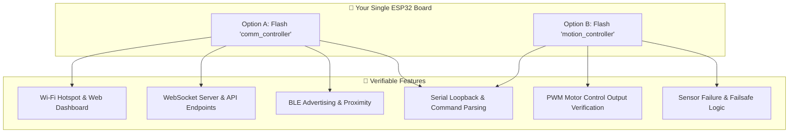

# 🧪 Single-ESP32 Board Testing Guide

This guide explains how to test, analyze, and validate the **Omni-Morph Robot Framework** using **only one standard ESP32 development board**. 

While the production robot employs a distributed tri-core system (Comm ESP32 + Motion ESP32 + AI Brain Laptop/SBC), you can verify almost all code pathways, network endpoints, web portals, logic state machines, and interface protocols using a single board by switching firmware profiles and using simple hardware loopbacks.

---

## 📐 System Mapping vs. Single ESP32 Testing

The project consists of two distinct firmware builds, both targeting the `esp32dev` platform. This means your single ESP32 can act as either the **Communication Layer** or the **Physical Actuation Layer**:



---

## 🛠️ Step 1: Compilation Verification

Before uploading, ensure that both projects compile cleanly on your computer. This confirms all library dependencies are met.

Open your terminal in the respective directory and run the compilation command:

### 1. Compile Communication Controller
```powershell
cd comm_controller
pio run
```
*   **What this checks:** Verifies libraries like `Adafruit SSD1306`, `WebSockets`, `ESP32-A2DP`, `audioI2S`, `arduinoFFT`, and `ArduinoJson` are present and compile without syntax errors.

### 2. Compile Motion Controller
```powershell
cd ../motion_controller
pio run
```
*   **What this checks:** Verifies libraries like `ESP32Servo`, `Adafruit PWM Servo Driver`, and `MPU6050` compile correctly.

---

## 🌐 Setup A: Testing the Communication Controller (Comm Profile)

Flashed onto your single ESP32, the `comm_controller` firmware controls connectivity, the local web server, WebSockets, Bluetooth, and OLED display graphics.

### 1. Pin Configuration Check
If you don't have the OLED, SIM7600, or I2S Microphone/Speaker wired, disable their features in `comm_controller/src/Config.h` to prevent initialization hangs:

```cpp
#define USE_OLED_DISPLAY false    // Disable if no physical SSD1306 display is connected
#define USE_AUDIO_SYSTEM false    // Disable if no I2S microphone/DAC is connected
#define USE_4G_FALLBACK  false    // Disable if SIM7600 is not wired
```

### 2. Flash and Run
Upload the code to your ESP32:
```powershell
cd comm_controller
pio run -t upload
```

### 3. Possible Tests to Run:
*   **Wi-Fi Access Point Test:** Connect your phone or laptop to the Wi-Fi network `Remote-car` (password: `12345678`). Verify that your device gets an IP address (usually `192.168.4.2`).
*   **Web Dashboard Test:** Open your browser and navigate to `http://192.168.4.1`. The robot's control web dashboard should load instantly.
*   **WebSocket Interaction Test:** Use the dashboard to press movement buttons (Forward, Backward, Left, Right). Check the **Arduino Serial Monitor** (set to `115200` baud). You should see printouts indicating the WebSocket received the command and attempted to send it to the Motion Controller, e.g., `Action Received: CMD:FORWARD`.
*   **Command Line Console Simulation:** You can type commands directly into the Serial Monitor input bar and press Enter to see how the board reacts:
    *   Type `CMD:SCAN` ➡️ Triggers WiFi and BLE scanning routines.
    *   Type `FACE:1` ➡️ Changes internal expression settings.
    *   Type `SAY:Hello Robot` ➡️ Simulates Speech output.
*   **BLE Broadcast Verification:** Use a BLE Scanner app on your phone (like LightBlue or nRF Connect) and scan for `Omni-Core-BT` to verify the Bluetooth radio is broadcasting.

---

## 🦾 Setup B: Testing the Motion Controller (Motion Profile)

Flashed onto your single ESP32, the `motion_controller` firmware runs FreeRTOS tasks to execute transformations, control DC motors/servos, read obstacle sensor data, and run automatic failsafes.

### 1. Disable the Safety Heartbeat (Crucial for Single-Board Testing)
By default, the Motion Controller halts all actions if it doesn't receive a `"BEAT"` command from the Comm Controller every 2.5 seconds (representing a connection loss). 
To test physical motion control without the second board, you should temporarily disable this failsafe.

Modify `motion_controller/src/Config.h`:
```cpp
// Set HEARTBEAT_TIMEOUT_MS to a very large number (e.g., 2 hours) to disable the failsafe
#define HEARTBEAT_TIMEOUT_MS 7200000 
```

### 2. Disable Physical Driver Checks
If you don't have the PCA9685 servo shield or MPU6050 connected, update `motion_controller/src/Config.h`:
```cpp
#define USE_MPU6050      false    // Disable if no physical IMU is wired
#define USE_SERVO_DRIVER false    // Disable if PCA9685 is not connected
#define USE_ULTRASONIC   false    // Disable if HC-SR04 is not connected
```

### 3. Flash and Run
Upload the code to your ESP32:
```powershell
cd motion_controller
pio run -t upload
```

### 4. Possible Tests to Run:
*   **Command Parsing via USB Serial Monitor (No Code Changes Needed!):** 
    We have pre-configured the Motion Controller to read command inputs from *both* the inter-controller link (`Serial2` on Pins 4/15) and the USB serial monitor (`Serial`).
    
    You do not need to make any manual changes to the code. Simply open the **Serial Monitor** (set to `115200` baud) in your IDE or use a tool like miniterm:
    *   Type `CMD:FORWARD`, `CMD:STOP`, `CMD:TRANSFORM`, or `CMD:CRAWLER` and press Enter.
    *   Watch the ESP32 console log confirm receipt and execution of the motion commands!
*   **PWM Output Validation (Voltage Checks):**
    Use a multimeter or connect simple LEDs (with 220Ω resistors) to the motor driver control pins:
    *   **GPIO 27 & 26** (Motor Left Direction)
    *   **GPIO 25 & 33** (Motor Right Direction)
    *   **GPIO 14 & 12** (PWM Speed Control)
    
    When you send `CMD:FORWARD`, the direction pins will transition to HIGH/LOW states, and the PWM pins will output an analog voltage corresponding to the speed (0V to 3.3V).
*   **Battery Alert Failsafe Test:**
    Connect a variable voltage source or potentiometer to the **Battery Monitor Pin (GPIO 34)**. By adjusting the voltage input down below `1.7V` (which simulates a depleted battery pack through the resistor divider), you can verify that the serial console triggers `CMD:BATTERY_LOW` and `CMD:BATTERY_CRITICAL` alerts!

---

## 🔌 Advanced: Single-Board Hardware Loopback Tests

You can perform advanced loopback diagnostics with **no additional microcontrollers or modules** by connecting a few jumper wires on your single board.

### 1. Serial Link Echo Test (UART Loopback)
You can test the ESP32’s UART Transmit and Receive buffers internally by connecting a single female-to-female jumper wire.

*   **Wiring:** Connect the TX pin directly to the RX pin.
    *   For the Comm Controller: Connect **GPIO 15** (MOTION_LINK_TX) directly to **GPIO 4** (MOTION_LINK_RX).
    *   For the Motion Controller: Connect **GPIO 15** (COMM_LINK_TX) directly to **GPIO 4** (COMM_LINK_RX).

```
          ┌─────────────────────────┐
          │     Single ESP32        │
          │                         │
          │   [GPIO 15]  ──(TX)──┐  │
          │              ┌───────┘  │
          │   [GPIO 4]   ◄─(RX)─────┘  │
          └─────────────────────────┘
```

*   **Test:** Any data sent from the code via `Serial2.println("TEST DATA")` will immediately be received by `Serial2.read()`. If you monitor the serial output, it will print that it received its own command, confirming the internal UART hardware buffers are 100% operational!

### 2. I2C Bus Diagnostics Scanner
Even with only one board, you can plug in a single I2C device (like the MPU6050 IMU or the OLED display) to verify the physical I2C pins.
*   **Wiring:**
    *   **OLED/IMU SDA** ➡️ **GPIO 21**
    *   **OLED SCL** ➡️ **GPIO 23** (on Comm Board) or **GPIO 22** (on Motion Board/Standard I2C)
    *   **GND** ➡️ **GND**
    *   **VCC** ➡️ **3.3V**
*   **Test:** Boot the board and look at the Serial Monitor. If the address is found (e.g. `0x3C` for OLED or `0x68` for MPU6050), it confirms your I2C pull-ups, lines, and target device registers are operational.

---

## 📋 Comprehensive Testing Checklist (Single-ESP32)

Here is a quick reference matrix of what you can test with your single ESP32:

| Component Tested | Firmware Profile | Hardware Setup Needed | Verification Method |
| :--- | :--- | :--- | :--- |
| **Web Server / HTML UI** | `comm_controller` | USB Cable | Open `192.168.4.1` on laptop/phone |
| **WebSockets Gateway** | `comm_controller` | USB Cable | Press buttons on dashboard; watch Serial Monitor |
| **WiFi Scanning (Sniffer)** | `comm_controller` | USB Cable | Send `CMD:SCAN` over Serial; watch AP detections |
| **BLE Radio Beacon** | `comm_controller` | USB Cable | Search for `Omni-Core-BT` using phone app |
| **Command Engine Logic** | `motion_controller` | USB Cable + Serial override | Send `CMD:FORWARD` over Serial; watch console log |
| **Motor Drive Signals** | `motion_controller` | Multimeter / LEDs | Measure voltage on GPIO 27, 26, 25, 33, 14, 12 |
| **Serial Bus Loopback**| Either Profile | Jumper wire (GPIO 15 to 4) | Check if sent UART commands return as echo |
| **Battery Safety Level** | `motion_controller` | Potentiometer on GPIO 34 | Lower voltage input; look for critical stop alert |
| **ArduinoOTA Flashing** | Either Profile | USB (First flash) + WiFi | Flash new firmware over-the-air wirelessly |

---

> [!TIP]
> **Recommended Next Step:** Flash the `comm_controller` first. It requires no extra hardware to host the Wi-Fi portal and WebSocket backend. Connect your phone, open the dashboard, and send commands. It's the fastest way to verify the entire user interface and network code on your desk!
